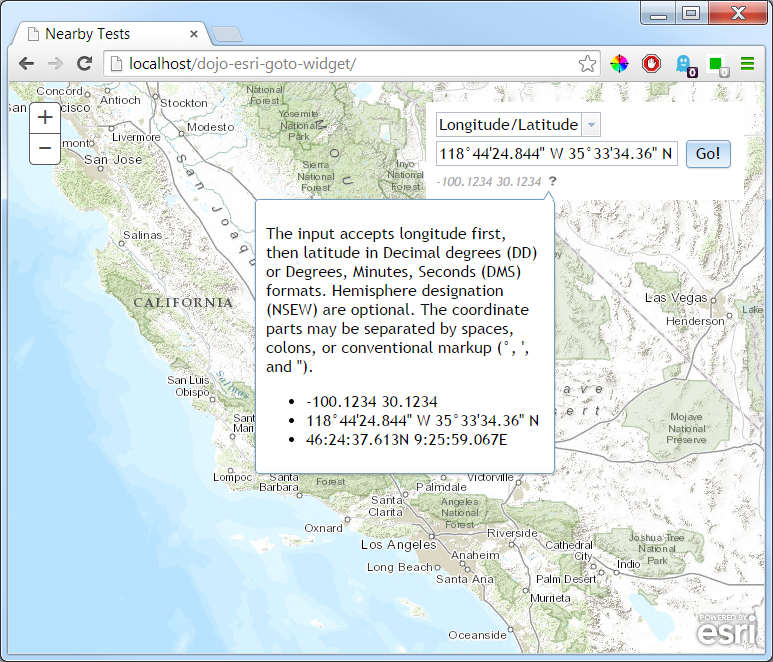

dojo-esri-goto-widget
=================
Goto widget for the esri js api. Accepts longitude/latitude, UTM, and MGRS coordinates.

Longitude/Latitude
------------------
The input accepts longitude first, then latitude in Decimal degrees (DD) or Degrees, Minutes, Seconds (DMS) formats. Hemisphere designation (NSEW) are optional. The coordinate parts may be separated by spaces, colons, or conventional markup (&deg;, \', and ").

UTM
---
The input accepts Northing or Easting first, but coordinate designation letter is mandatory (NE). The word "Zone" is optional. The hemisphere designation (NS) is optional and defaults to N.

MGRS
----
The input accepts a grid zone designator (4Q), grid square id (FJ), and an even number of additional precision numbers (12345678). See wikipedia entry on [Military Grid Reference System](http://en.wikipedia.org/wiki/Military_grid_reference_system) for additional info.


```javascript
var gotoWidget = new Goto({
	map: this.map, //reference to the jsapi map object
}, "referenceNode");
gotoWidget.startup();
```

[Click for demo](http://brianbunker.github.com/dojo-esri-goto-widget)

Screen from Sample page:


